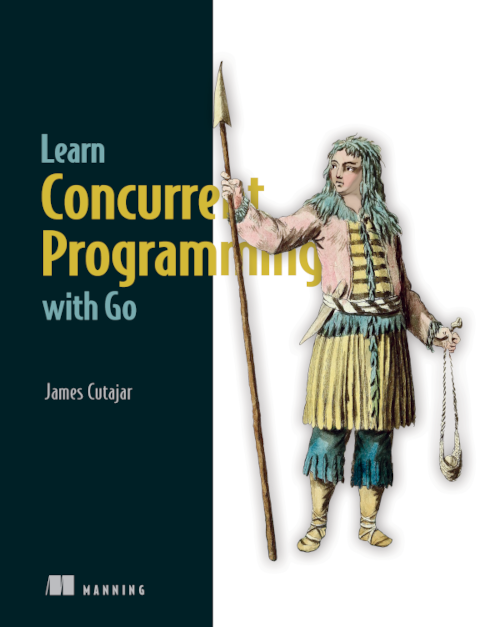

# Learn Concurrent Programming With Go
Listings from the manning book   
Title: Learn Concurrent Programming With Go  
Author: James Cutajar  
ISBN: 9781633438385  
[Book can be purchased here.](https://manning.com/books/learn-concurrent-programming-with-go?utm_source=cutajarj&utm_medium=affiliate&utm_campaign=book_cutajar_learn_12_14_22&a_aid=cutajarj&a_bid=4360d6bb)  
You can use the 35% discount code on any manning book: **au35cut**   

#### Please note this repo is not for the Udemy course.

